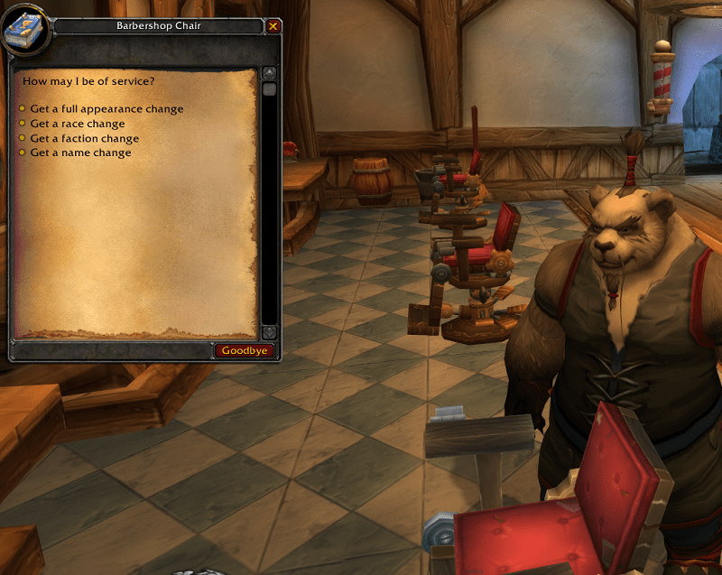

# mod-barberchair

### This is a module for [AzerothCore](http://www.azerothcore.org)

### This module extends the barbershop chair features for [AzerothCore](http://www.azerothcore.org)

- Latest build status with azerothcore:

[](https://github.com/valsan-azerty-boi/mod-barberchair)

#### Features:

This module allows players to get different character services directly from the **barbershop chair**.

1.  **Normal barbershop chair feature**: Opens the standard in game character customization interface
2.  **Full Appearance Change**: Give a full re-customization at character selection screen
3.  **Race Change**: Give a race change at character selection screen
4.  **Faction Change**: Give a faction change at character selection screen
5.  **Name Change**: Give a renaming at character selection screen

---

### How to install

1. Simply place the module under the `modules` folder of your AzerothCore source folder.
2. Re-run cmake and launch a clean build of AzerothCore.
3. Import the SQL file in your world database.
4. Edit the module configuration file.
5. Done.

---

### Usage

1. Interact with a barbershop chair 
2. Select a service.





---

## Configuration

All configuration options are located in the `barberchair.conf` file.

Default configuration:
```
Barberchair.Enable = 0
-- 1 to enable the module

Barberchair.FullAppearanceChangeFeature.Enable = 1
Barberchair.RaceChangeFeature.Enable = 0
Barberchair.FactionChangeFeature.Enable = 0
Barberchair.NameChangeFeature.Enable = 0
-- 1 to give each of this service to the barbershop chair

Barberchair.BaseFeature.Enable = 1
Barberchair.BaseFeature.RaceExclusion = 9,12,13,14,15,16,17,18,19,20,21,22,23,24,25,26,27,28,29,30,31,32,33
-- 1 to also keep the normal barberchair feature, if you use some custom/retroported race you can exclude them from the normal feature

Barberchair.ModIndividualProgression.Integration.Enable = 0
-- 1 to correctly phase the barbershop chair if you use ModIndividualProgression
```

---

## Credits

* [valsan-azerty-boi](https://github.com/valsan-azerty-boi) : Module author
